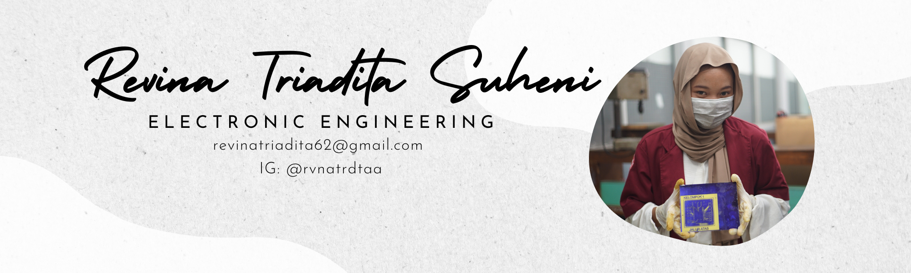
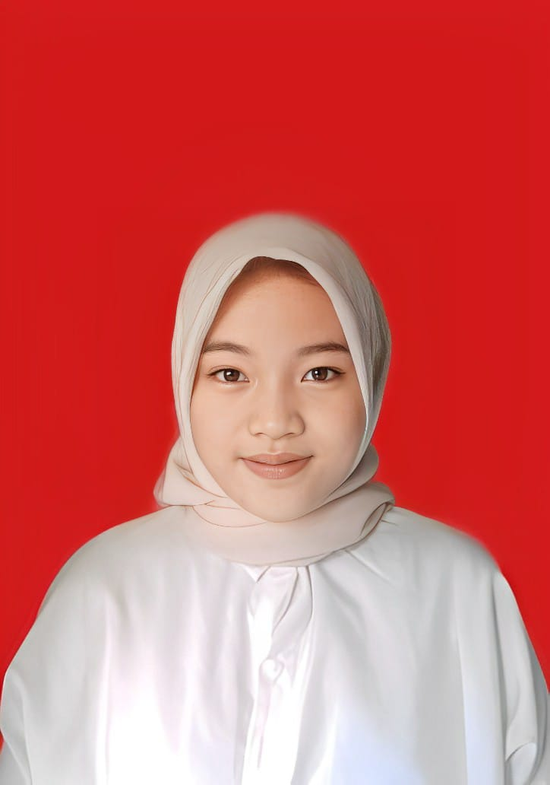

  

<table>
  <tr>
    <td width="150px" align="center" valign="top">
      
    </td>
    <td valign="top">
      <h1>Haiii! Saya Revina Triadita Suheni 👋</h1>
      <h3>Electronic Engineering Graduated | Sistem Otomasi & Kontrol</h3>
      

        
        
        
      

    </td>
  </tr>
</table>

---

## 🚀 Tentang Saya

Seorang lulusan **Teknik Elektronika** dari **Politeknik Negeri Semarang** dengan landasan pengetahuan yang kuat di bidang otomasi industri, elektronika dasar, dan sistem tenaga listrik. Berpengalaman dalam melaksanakan instalasi listrik, konfigurasi panel kontrol, serta pemrograman mikrokontroler & PLC untuk memastikan operasional industri berjalan dengan efisien dan aman.

- 📍 Berdomisili di Semarang, Indonesia
- ⚙️ Sangat tertarik pada pemrograman PLC, pengembangan IoT, dan sistem monitoring cerdas.

---

## 🛠️ Keahlian & Teknologi

| Kategori | Teknologi / Keahlian |
| :--- | :--- |
| **Perangkat Keras & Kontroler** | PLC, Mikrokontroler (Arduino, dll), Panel Kontrol, Motor Listrik |
| **Perangkat Lunak & Simulasi** | Arduino IDE, Proteus, Visio |
| **Teknik Elektro** | Rangkaian Listrik Industri, Instalasi Listrik (Industri & Domestik) |
| **Produktivitas** | MS Office |

---

## 📈 Proyek Pilihan

* **Sistem Monitoring Parameter Tangki** – Mengembangkan dashboard pemantauan dan visualisasi cerdas untuk parameter sistem pemantauan air domestik.
* **Instalasi Smart Home Menggunakan Tenaga Surya** – Mengintegrasikan komponen energi terbarukan untuk otomatisasi rumah yang berkelanjutan.
* **Sistem Pemberi Pakan Ikan Jarak Jauh** – Membangun konfigurasi mikrokontroler berbasis IoT untuk kontrol peternakan jarak jauh.
* **Instalasi Star-Delta Industri** – Merancang dan merakit pengkabelan sistem kontrol yang kuat serta distribusi listrik.

---

## 💼 Pengalaman

* **CV. Sarana Cipta Media** – *Assembly & Training Development (Magang | 2025)*
    * Merakit kit pelatihan elektronika industri berdasarkan skema teknis.
    * Mengembangkan materi dan modul pelatihan yang komprehensif untuk konsep-konsep industri.
* **PT. Askana Jaya Santoso** – *Magang (2024)*
    * Mengelola komponen pemeliharaan penerangan jalan umum, Melakukan pemantauan pemeliharaan & perawatan penerangan jalan umum, log inventaris, dan catatan gudang.
* **PT. Arina Multi Karya** – *Reliever (2024)*
    * Mengoperasikan mesin pengemasan otomatis untuk memastikan proses packing produk berjalan sesuai target produksi.

---

## 📜 Sertifikasi

* **Instalasi Listrik 3-Fasa** – *BNSP*
* **Otomasi Industri** – *BNSP*
* **Desain & Pembuatan PCB untuk Industri** – *Indomaker*
* **Kesehatan dan Keselamatan Kerja / K3** – *Akualita*

---

## 📫 Hubungi Saya
* **Email:** revinatriadita62@gmail.com
* **LinkedIn:** [Revina Triadita](https://www.linkedin.com/in/revinatriaditasuheni?utm_source=share_via&utm_content=profile&utm_medium=member_android)

---

🛠️ Dibuat dengan dedikasi untuk Otomasi & Elektronika | © 2026 Revina Triadita
